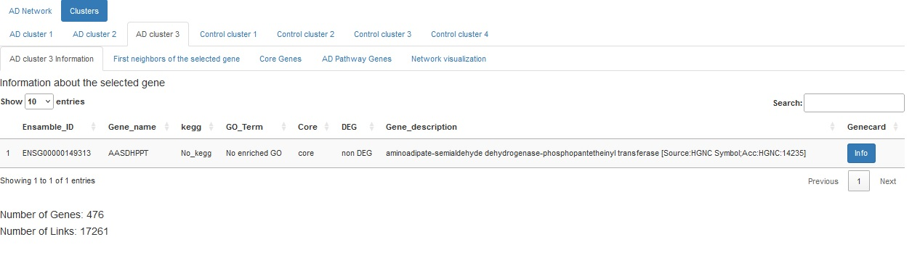
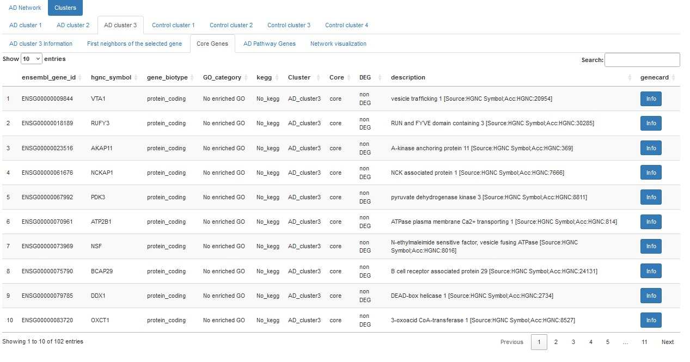
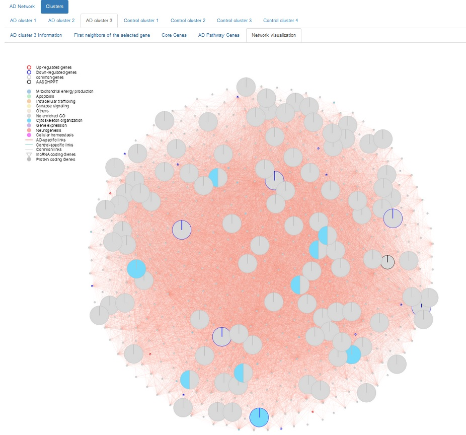

**ADNet User Guide**

ADNet is a Shiny app designed to facilitate exploration of the temporal cortex Alzheimer's disease (AD) and control gene co-expression networks. It provides a user-friendly interface to examine detailed network information, offering valuable insights for research and further analysis. For more in-depth information about the research and methodology behind ADNet, please refer to the associated paper: [paper title-link].

In ADNet, additional key data is embedded, such as each gene's known function, degree, hub status, differential expression (DEG), gene type (protein-coding or lncRNA), clusters and involvement in Alzheimer's disease pathways according to the KEGG database. This information is presented in a clear, easily navigable table format, allowing quick access to essential metrics and simplifying the process of exploring the gene networks.


# **Table of Contents and Additional Tutorials**  
_____________________________________________________

1. [Installation](#installation)
2. [Quick Start Guide](#quick-start-guide)

---

## **1. Installation**  

We recommend using **RStudio** for running the Shiny app. First, users should ensure that all required packages for ADNet are installed. The following R code checks for the required packages and installs any that are missing:

```r
reqPkg = c("data.table", "Matrix", "igraph", "qgraph", "DT", 
           "dplyr", "shinydashboard", "biomaRt")
newPkg = reqPkg[!(reqPkg %in% installed.packages()[,"Package"])]
if(length(newPkg)){install.packages(newPkg)}
```
### Steps to Install and Run ADNet:

#### **Download the Code:**

1. Click on the green button labeled **"Code"** on the top right.
 
 
2. Download the project as a **Zip** file.
3. Extract the folder and open the project **Shiny_app_ADnet.Rproj**.
4. Open the file `script/shiny_app_ADnet.R`.
5. Start the application by clicking on **"Run App"** in the top right corner. The app will start in a browser after approximately 30 seconds.

---

### In the App:

- In the top center, you can click through the different tabs.

#### **AD Network Tab:**

- You can switch between the **gene co-expression network**, information about the network, the **AD KEGG pathway**, and the **core genes**.

 

---

#### **Clusters Tab:**

- In this tab, you can select a cluster, and for each cluster, there are options to view:

  - **Cluster information**, including basic information about the selected gene.  
   
  
  - **First neighbor, core, and AD KEGG pathway genes**.  
   

- Each table in this section allows you to search for specific genes or terms.
- The respective network visualization of each cluster is also available under **Network visualization** tab.

  

---

### To Visualize a Selected Cluster:

1. Select the **Clusters** tab, then choose the desired cluster, followed by **Network visualization**.

   

2. On the left sidebar, choose:
   - Which **node attributes** to display.
   - The **gene of interest** in the selected cluster.


3. Press **PLOT!** at the bottom of the sidebar to visualize the cluster (it may take a few seconds). If you change parameters, press **PLOT!** again to refresh the visualization.

---

### **Node Information:**

- **Node Border Colors**:
  - **Black** = The selected gene.
  - **Red** = Up-regulated genes.
  - **Blue** = Down-regulated genes.

- **Node Sizes (from large to small)**:
  - Core genes.
  - Selected gene.
  - if selected AD pathway genes/ First neighbor genes.
  - No specific attribute.

---

### **GO Term Color Code**:

  

---

### **Link Colors Between Nodes**:

- **Red**: AD-specific links.
- **Green**: Control-specific links.
- **Grey**: Conserved links.

If you choose to display links with a **wTO range**, the graph will show only the links from the selected gene, without distinguishing AD/control-specific links.
