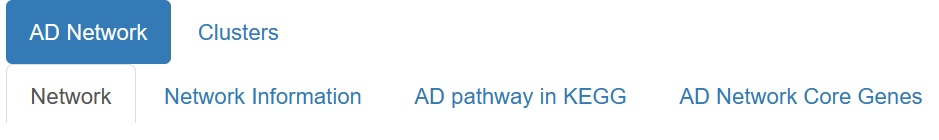
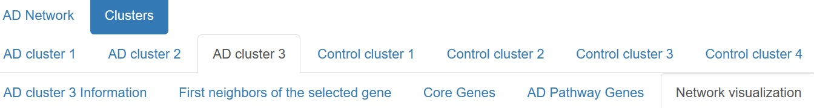
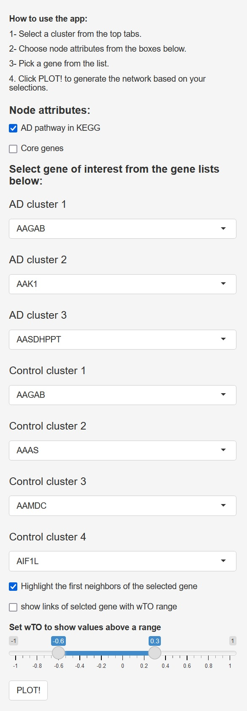
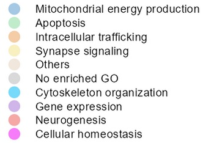

Shiny App ADNet is an R project that allows users to visualize interactively in a Shiny-based web application the gene co-expression of the TCX AD/Control Consensus Networks 
by visualizing the gene co-expression of all genes within three AD and four control clusters, 
additionally it offers detailed information about the networks in a user-friendly table format, giving you quick access to key metrics and insights for further analysis.

Key features of Shiny App ADNet include:

    1. Written in R and uses the Shiny package, allowing for easy sharing on online platforms e.g. shinyapps.io and Amazon Web Services (AWS), or be hosted via Shiny Server

    2. Information about the AD network including the core genes and the AD KEGG pathway

    3. Information about the gene co-expression clusters of the AD and the control networks including gene descriptions, first neighbor, core, and AD Pathway genes

    4. Visualization of the AD Network 

    5. Interactive plots of the gene co-expression networks for each cluster, with selectable parameters: AD pathway genes, core genes, first neighbor genes, and strength of wTO correlation.

Table of Contents and Additional Tutorials
_____________________________________________________

1. Installation
2. Quick Start Guide

1.Installation 

RStudio is preferable to use.
First, users can run the following code to check if the packages required by Shiny App ADNet exist and install them if required:

    reqPkg = c("data.table", "Matrix", "igraph", "qgraph", "DT", 
           "dplyr", "shinydashboard", "biomaRt")
    newPkg = reqPkg[!(reqPkg %in% installed.packages()[,"Package"])]
    if(length(newPkg)){install.packages(newPkg)}

2.Quick Start Guide

Shiny App ADNet can then be installed from GitHub as follows:

https://github.com/mpstar92/Shiny_App_ADnet
Click on the green button <>Code on the top right and download Zip

Extract the folder and open the project Shiny_app_ADnet.Rproj
Open file script/shiny_app_ADnet.R
Start the application by clicking on "Run App" in the top right corner. (App will start in a browser after a ~ 30 seconds)

In the App:

In the top center you can click through the different tabs.

In the AD Network tab you can change between the gene co-expression network, information about the network, the AD KEGG pathway and the core genes.

In the Clusters tab you can select a cluster, and for each cluster is a tab for 
 cluster information including basic information about the selected gene,
 the first neighbor, core and AD KEGG pathway genes 
 and the respective interactive plot.

In each table you can search for specific genes or terms.

To get a visualization of your cluster of choosing:

Select the Tabs Clusters; the cluster; Network visualization:

Select in the left sidebar: 

which node attributes to display and the gene of interest in that cluster,
Press PLOT! at the bottom of the sidebar to visualize the cluster (it may take a couple of seconds and if you change parameters press PLOT! again)

the color of the border of a node:

    black = the selected gene
    red = up-regulated
    blue = down regulated
 
the size of the nodes from big to small:

    core genes
    selected gene
    AD pathway genes
    first neighbor genes
    no attribute

the color code for the associated GO terms

the links between nodes are colored:

    red = AD-specific
    green = control specific
    grey else

if you select to show the links of selected gene with wTO range the graph will only show the links from the selected genes and not AD/control-specific links.

